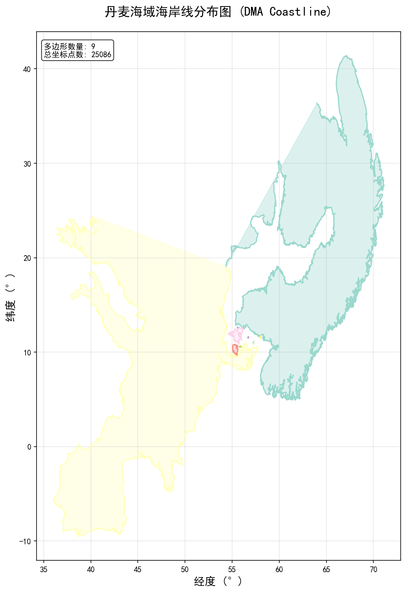

# TrAISformer - AIS 轨迹预测模型

基于 Transformer 架构的船舶自动识别系统（AIS）轨迹预测深度学习模型。


## 📋 项目简介

TrAISformer 是一个用于预测船舶航行轨迹的深度学习模型，采用 Transformer Encoder-Decoder 架构，能够根据历史 AIS 数据预测船舶未来的位置、速度和航向。

### 🎯 主要功能
- **轨迹预测**: 基于历史轨迹预测船舶未来航行路径
- **多步预测**: 支持 2-12 小时的连续预测
- **数据处理**: 完整的 AIS 数据预处理和清洗流程
- **高质量可视化**: 单独轨迹图生成，支持中文标签
- **数据转换**: PKL 转 CSV 工具，便于数据分析
- **设备兼容**: 自动 GPU/CPU 设备管理和错误修复
- **模块化设计**: 清晰的模块分离，易于扩展和维护

## 🚀 快速开始

### 环境要求
- Python 3.7+
- CUDA 支持的 GPU（推荐）
- Anaconda 或 Miniconda

### 1. 环境安装

```bash
# 克隆项目
git clone <repository-url>
cd TrAISformer

# 创建 conda 环境
conda env create -f requirements.yml

# 激活环境
conda activate traisformer
```

### 2. 数据准备

#### 方式一：使用现有数据
```bash
# 数据应放置在以下目录结构：
data/
├── ct_dma/
│   ├── ct_dma_train.pkl
│   ├── ct_dma_valid.pkl
│   └── ct_dma_test.pkl
```

#### 方式二：转换 CSV 数据
```bash
# 将 AIS CSV 数据转换为模型所需格式
python convert_ais_fixed.py

# 清洗异常值
python remove_outliers.py
```

### 3. 模型训练

```bash
# 完整训练流程
python main.py

# 仅训练模型
python main.py --train-only

# 仅评估模型
python main.py --eval-only

# 仅可视化结果
python main.py --viz-only
```

### 4. 兼容性运行
```bash
# 使用原始接口运行
python run_transformer.py
```

## 📁 项目结构

```
TrAISformer/
├── README.md                 # 项目说明文档
├── requirements.yml          # 环境依赖配置
├── config_transformer.py     # 模型和训练配置
├── main.py                  # 主入口文件
├── run_transformer.py       # 兼容性运行脚本
│
├── 核心模块/
│   ├── data_loader.py       # 数据加载和预处理
│   ├── datasets.py          # PyTorch 数据集定义
│   ├── models.py            # Transformer 模型架构
│   ├── trainers.py          # 训练和采样逻辑
│   ├── train.py             # 模型训练模块
│   ├── evaluate.py          # 模型评估模块
│   ├── visualize.py         # 结果可视化模块
│   └── utils.py             # 工具函数
│
├── 数据处理工具/
│   ├── convert_ais_fixed.py    # CSV 转 PKL 工具
│   ├── remove_outliers.py      # 异常值清洗工具
│   ├── csv_to_pkl_converter.py # 数据转换工具
│   └── pkl_to_csv_converter.py # PKL 转 CSV 工具

├── 测试和分析工具/
│   ├── test_prediction_lengths.py # 预测长度性能测试
│   └── pkl_viewer.py              # PKL 文件查看器（新增）
│
├── 可视化工具/
│   ├── simple_plot.py       # 简单轨迹绘制
│   ├── plot_trajectories.py # 详细轨迹可视化
│   ├── plot_top_mmsi.py     # MMSI 数据分析
│   └── coastline_visualization/  # 海岸线可视化
│       ├── coastline_interactive.png  # 交互式海岸线图
│       └── coastline_overview.png     # 海岸线概览
│
└── data/                    # 数据目录
    └── ct_dma/             # 数据集
```



## ⚙️ 配置说明

### 主要配置参数（config_transformer.py）

```python
# 模型参数
n_head = 8              # 注意力头数
n_layer = 8             # 层数
batch_size = 32         # 批大小
max_epochs = 15         # 训练轮数

# 序列参数
init_seqlen = 18        # 输入序列长度
prediction_steps = 24   # 预测步数（4小时）
max_seqlen = 120        # 最大序列长度

# 数据参数
dataset_name = "ct_dma" # 数据集名称
lat_size = 250          # 纬度词汇表大小
lon_size = 270          # 经度词汇表大小
```

### 预测时间配置
```python
# 修改 prediction_steps 来设置不同的预测时长：
prediction_steps = 12   # 2小时预测
prediction_steps = 24   # 4小时预测（默认）
prediction_steps = 36   # 6小时预测
prediction_steps = 48   # 8小时预测
prediction_steps = 72   # 12小时预测
```

## 🧪 预测长度性能测试

### 自动化测试工具
项目提供了 `test_prediction_lengths.py` 脚本，可以自动测试不同预测长度的性能：

```bash
# 运行预测长度测试
python test_prediction_lengths.py
```

### 测试配置
脚本会自动测试以下预测长度：
- **2小时** (12步): 短期精确预测
- **3小时** (18步): 短中期预测  
- **4小时** (24步): 默认配置
- **5小时** (30步): 中期预测
- **6小时** (36步): 中长期预测
- **8小时** (48步): 长期预测
- **10小时** (60步): 超长期预测
- **12小时** (72步): 最长预测

### 生成报告
测试完成后会在 `results/*/prediction_length_tests/` 目录生成：
- `prediction_length_comparison.csv`: 详细性能数据
- `prediction_length_comparison.png`: 可视化对比图表
- `prediction_length_report.txt`: 分析报告和推荐配置

### 使用建议
根据测试结果选择最适合你应用场景的预测时长：
- **实时导航**: 推荐 2-4 小时预测
- **航线规划**: 推荐 4-8 小时预测  
- **长期分析**: 可使用 8-12 小时预测

## 📊 数据格式

### 输入数据格式
PKL 文件包含轨迹列表，每条轨迹格式：
```python
{
    'mmsi': int,                    # 船舶标识符
    'traj': numpy.ndarray          # 形状 (N, 6) 的轨迹数据
}

# 轨迹矩阵的 6 列：
# 列0: 纬度 (归一化到 [0, 1))
# 列1: 经度 (归一化到 [0, 1))
# 列2: 速度 SOG (归一化到 [0, 1))
# 列3: 航向 COG (归一化到 [0, 1))
# 列4: Unix 时间戳
# 列5: MMSI (重复存储)
```

### CSV 数据转换
支持标准 AIS CSV 格式，包含以下列：
- Timestamp, MMSI, Latitude, Longitude, SOG, COG 等

## 🔧 使用示例

### 1. 训练新模型
```bash
# 修改配置文件
vim config_transformer.py

# 开始训练
python main.py --train-only
```

### 2. 评估现有模型
```bash
# 评估模型性能
python main.py --eval-only

# 查看评估结果
ls results/*/evaluation_results.pkl
```

### 3. 可视化结果
```bash
# 生成可视化图表（包含单独轨迹图）
python main.py --viz-only

# 查看轨迹图
python simple_plot.py

# 分析 MMSI 数据
python plot_top_mmsi.py

# 生成的可视化文件：
# - prediction_errors.png      # 预测误差曲线
# - error_comparison.png       # 误差对比图
# - trajectory_samples.png     # 预测轨迹样本图
# - trajectory_plots/          # 单独轨迹图目录


#   ├── trajectory_1_*.png     # 轨迹1预测图
#   ├── trajectory_2_*.png     # 轨迹2预测图
#   └── ...
# - evaluation_report.txt      # 评估报告


### 4. 数据处理

执行以下命令进行数据处理：

```bash
# 转换 CSV 数据为 PKL
python convert_ais_fixed.py

# 转换 PKL 数据为 CSV（便于分析）
python pkl_to_csv_converter.py

# 清洗异常值
python remove_outliers.py

# 可视化数据质量
python plot_trajectories.py
```

### 5. 预测长度性能测试
```bash
# 自动测试多种预测长度的性能
python test_prediction_lengths.py

# 生成的测试结果：
# - prediction_length_comparison.csv    # 性能对比数据
# - prediction_length_comparison.png    # 可视化对比图
# - prediction_length_report.txt        # 详细分析报告
```

### 6. PKL 文件查看
```bash
# 交互式查看所有 PKL 文件
python pkl_viewer.py

# 查看特定文件
python pkl_viewer.py data/ct_dma/ct_dma_train.pkl

# 查看详细信息
python pkl_viewer.py data/ct_dma/ct_dma_train.pkl --detailed

# 查看目录中所有 PKL 文件
python pkl_viewer.py --all
```

## 📈 模型性能

### 评估指标
- **位置误差**: 预测位置与真实位置的距离误差
- **时间序列**: 不同预测时长的误差变化
- **采样一致性**: 多次采样结果的稳定性

### 预期性能
- **2小时预测**: 平均误差 < 2km
- **4小时预测**: 平均误差 < 5km
- **8小时预测**: 平均误差 < 10km


### 性能测试工具
使用 `test_prediction_lengths.py` 可以：
- 自动测试 2-12 小时的预测性能
- 生成详细的性能对比报告
- 找到最适合的预测时长配置
- 可视化误差随时间的变化趋势

## 🛠️ 故障排除

### 常见问题

1. **CUDA 内存不足**
   ```python
   # 减小批大小
   batch_size = 16  # 或更小
   ```

2. **数据加载错误**
   ```bash
   # 检查数据路径
   ls data/ct_dma/
   
   # 重新转换数据
   python convert_ais_fixed.py
   ```

3. **依赖包缺失**
   ```bash
   # 重新安装环境
   conda env update -f requirements.yml
   ```

4. **设备不匹配错误**
   ```bash
   # 错误：RuntimeError: Expected all tensors to be on the same device
   # 解决：已在 main.py 中修复，确保模型正确移动到 GPU
   ```

5. **导入错误**
   ```bash
   # 错误：ImportError: cannot import name 'TB_LOG'
   # 解决：已在 trainers.py 中修复导入路径
   ```

6. **中文字体显示问题**
   ```python
   # 在可视化脚本中已配置中文字体
   # 如仍有问题，请安装系统中文字体
   ```

## 📝 开发说明

### 添加新功能
1. 在相应模块中添加功能
2. 更新配置文件
3. 添加测试用例
4. 更新文档

### 模型改进
1. 修改 `models.py` 中的架构
2. 调整 `config_transformer.py` 中的参数
3. 重新训练和评估

## 📄 许可证

本项目基于 CECILL-C 许可证开源。

## 🤝 贡献

欢迎提交 Issue 和 Pull Request！

## 📧 联系方式

如有问题，请通过以下方式联系：
- 提交 GitHub Issue
- 发送邮件至项目维护者

## 🆕 更新日志

### v2.1.0 (2025-09-24)
- ✅ **修复设备兼容性**: 解决 GPU/CPU 设备不匹配错误
- ✅ **修复导入错误**: 修复 TB_LOG 导入问题
- 🎨 **优化可视化**: 单独轨迹图生成，支持中文标签
- 📊 **新增工具**: PKL 转 CSV 数据转换工具
- 🧪 **性能测试**: 预测长度自动化测试脚本
- 🔧 **改进错误处理**: 更好的异常处理和日志记录

### v2.0.0 (2025-09)
- 🚀 **重构架构**: Transformer Encoder-Decoder 架构
- 📦 **模块化设计**: 清晰的模块分离
- 🎯 **多模式运行**: 支持训练、评估、可视化独立运行

---

**最后更新**: 2025年9月24日

**当前版本**: 2.1.0 (稳定版)